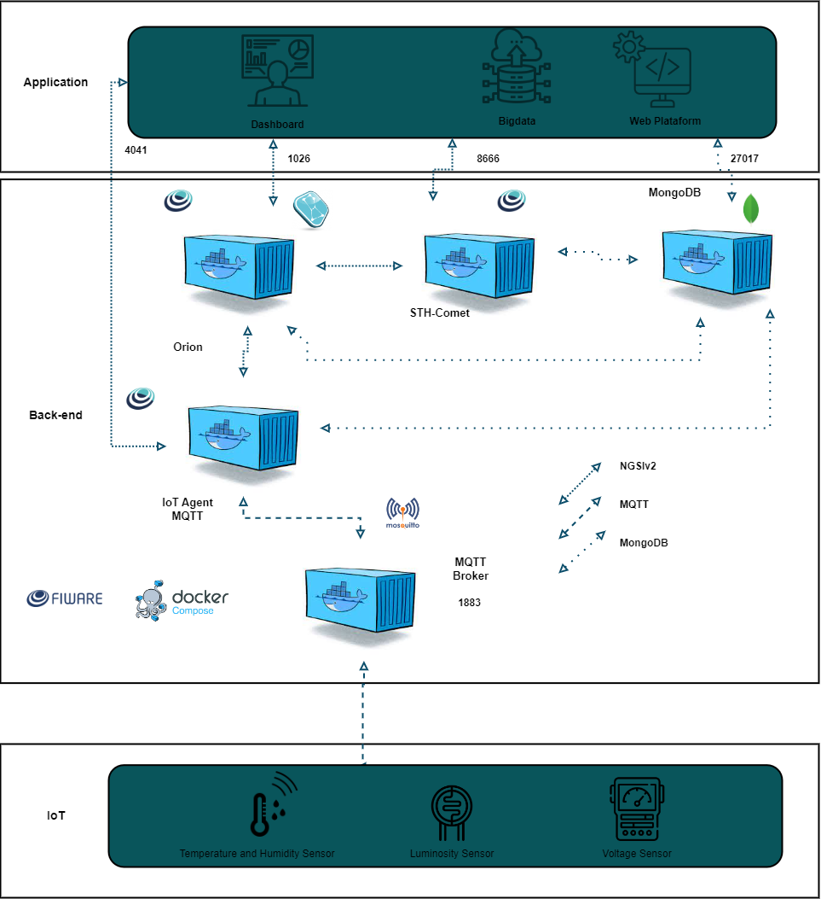

# Smart Energy 🍃🧠⚡

Smart Energy é uma solução baseada em IoT que visa mitigar os desafios técnicos e sociais da implementação de microrredes no Brasil, 
promovendo acesso universal à energia de forma sustentável, eficiente e inclusiva. 
Esta solução utiliza sensores e dispositivos para monitoramento em tempo real, oferecendo insights sobre consumo, geração e eficiência energética.

## 📌 Principais Informações
- Objetivo: Promover a gestão eficiente de microrredes, reduzindo sobrecargas, monitorando tensões e melhorando o gerenciamento de recursos energéticos.
- Tecnologias:

    - Sensores DHT22 (temperatura/umidade), LDR (luminosidade) e potenciômetro (simulação de tensão/corrente).
    - Microcontrolador ESP32 para coleta e envio de dados via MQTT.
    - Dashboard para visualização em tempo real dos dados coletados.
- Impacto:
  - Apoio à manutenção das microrredes.
  - Monitoramento para reduzir perdas e identificar problemas como afundamento de tensão.
  - Melhoria na inclusão energética em regiões remotas.
 
## Arquitetura 🔨

    
Draft da Arquitetura:

    
  

## Requisitos 🖥️
### Hardware
- Microcontrolador ESP32.
- Sensores:
    - DHT22.
    - LDR.
    - Potenciômetro.
    - Tela TFT
- Fonte de alimentação e protoboard para montagem do circuito.
## Software
- [Fiware Descomplicado](https://github.com/fabiocabrini/fiware)
- Python +3.9 para [Dashboard](dashboard.py)
- Azure
- Wokwi (Simulação)

## Dependências 📝
- Bibliotecas:
  - WiFi.h
  - PubSubClient.h
  - "DHTesp.h"
  - Adafruit_GFX.h
  - Adafruit_ILI9341.h

## Instruções de Uso 🚀
### 1. Faça uma Cópia da simulação no wokwi
- Com o [Link](https://wokwi.com/projects/414460259051014145) da simulação, faça uma cópia.
- Instale as bibliotecas necessárias.
### 2. Execute o Fiware Descomplicado
### 3. Execute o Dashboard
### 4. Execute a simulação

## Impactos Positivos 💡
- Inclusão Energética:
  - Facilita a integração de microrredes em comunidades remotas.
- Gestão Eficiente:
  - Reduz perdas, sobrecargas e problemas técnicos.
- Sustentabilidade:
  - Incentiva o uso de energias renováveis.
- Dados em Tempo Real:
  - Melhora a resposta a falhas e aumenta a eficiência do sistema.

## Autores
- [Giulia Barbizan](https://github.com/Giulia-Rocha)
- [Gustavo Viega](https://github.com/Vieg4)
- [Felipe Marques](https://github.com/FelipeMarquesdeOliveira)

## Links Úteis
  - [Wokwi](https://wokwi.com/projects/414460259051014145)
  - [Vídeo Explicativo]()

## Referências
- [Link 1](https://repositorio.ifg.edu.br/bitstream/prefix/1229/3/trab.evento_RenanMoreiraSoares_MarceloEscobardeOliveira.pdf)
- [Link 2](https://www.gta.ufrj.br/ensino/eel878/redes1-2016-1/16_1/smartgrid/#perguntas)
- [Link 3](https://www.ecodebate.com.br/2020/10/02/o-futuro-da-gestao-de-energia-sao-os-microgrids/)
